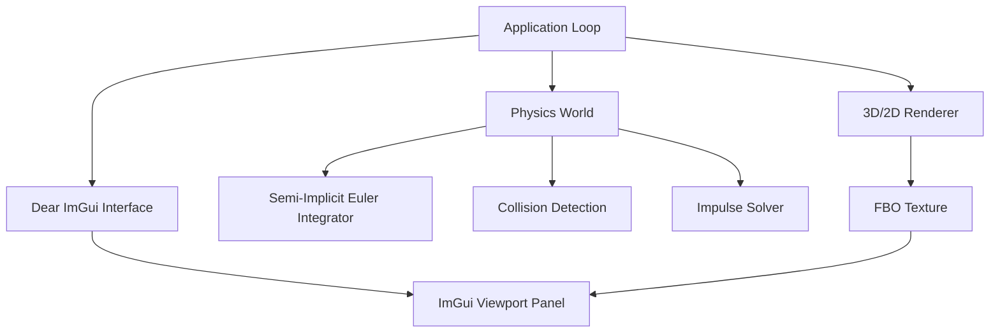

# Physix Implementation Roadmap 🗺️

Welcome to the **Physix** feature implementation plan. This directory contains detailed blueprints for all phases of the project, separating files by phase. Each document includes the **target filenames**, **necessary structures and variables**, **role of the engine component**, and **pseudo-code/math foundations** for implementation.

## 🧱 Architectural Overview

The engine follows a modular, decoupled architecture to ensure that the physics simulation is independent of the rendering and UI layers:



### 📁 Directory & Subsystem Layout

To keep the engine codebase clean, modular, and maintainable, all files are organized into designated subsystem folders. Headers go into `include/` and source files go into `src/`:

```text
Physix/
├── include/                   # All header files (.hpp)
│   ├── core/                  # Core engine lifecycle, window, and input
│   │   ├── app.hpp            # Main App manager coordinating subsystems
│   │   ├── window.hpp         # GLFW window context manager wrapper
│   │   ├── clock.hpp          # Precision fixed-timestep clock accumulator
│   │   ├── input_manager.hpp  # Mouse/keyboard event dispatcher callbacks
│   │   └── math_utils.hpp     # Mathematical structs & operators (Vec2, Cross, Dot)
│   │
│   ├── renderer/              # OpenGL wrappers and graphics routines
│   │   ├── shader.hpp         # GLSL shader compiler & uniforms
│   │   ├── vertex_array.hpp   # VAO wrapper
│   │   ├── vertex_buffer.hpp  # VBO wrapper
│   │   ├── index_buffer.hpp   # Element buffer (EBO) wrapper
│   │   ├── framebuffer.hpp    # FBO (Off-screen render texture target)
│   │   ├── camera.hpp         # 3D Orbit Camera & NDC mouse raycaster
│   │   ├── renderer2d.hpp     # Primitive batching shapes renderer
│   │   └── debug_draw.hpp     # Overlay overlays (AABBs, velocity arrows)
│   │
│   ├── physics/               # Physics simulation algorithms
│   │   ├── rigid_body.hpp     # Body states, materials, mass properties
│   │   ├── shape.hpp          # Collision boundary profiles (Circle, Box)
│   │   ├── world.hpp          # Simulation database holding rigid bodies
│   │   ├── integrator.hpp     # Semi-implicit Euler integration & sleep calculations
│   │   ├── spatial_hash.hpp   # Broadphase grid filtering
│   │   ├── collision.hpp      # Narrowphase intersection SAT solver
│   │   ├── manifold.hpp       # Contact depth, normal, and point representation
│   │   ├── solver.hpp         # Constraint sequential impulse solver
│   │   └── fluid_sim.hpp      # Smoothed Particle Hydrodynamics (SPH)
│   │
│   ├── procgen/               # Terrain and object placement layout
│   │   ├── terrain_gen.hpp    # Perlin heightmap mesh generator
│   │   ├── object_spawner.hpp # Grids, circles, stacks layouts generator
│   │   └── problem_factory.hpp# Preset physics scenarios definitions
│   │
│   └── ui/                    # Editor layout views and user interface
│       ├── imgui_layer.hpp    # Main docking system workspace setup
│       ├── viewport_panel.hpp # Displays FBO texture, handles focus/hover
│       └── editor_panels.hpp  # Inspector panel and scenario loader panels
│
├── src/                       # All C++ implementations (.cpp)
│   ├── core/                  # App, window, clock, input implementations
│   ├── renderer/              # Shaders, camera, renderer, buffers, debug draw
│   ├── physics/               # Physics ticker, broadphase, SAT, impulse solver, SPH
│   ├── procgen/               # Procedural heightmap & layout spawners
│   ├── ui/                    # UI layers, viewports, panels
│   └── main.cpp               # Thin entry point instantiating & starting App
│
├── shaders/                   # GLSL shader source codes
│   ├── flat.fs                # Vertex shader for 2D primitives
│   ├── flat.vs                # Fragment shader for 2D primitives
│   ├── fluid.fs               # Shader for soft radial fluid drops
│   └── fluid.vs
│
├── tools/                     # Submodules / external dependencies
│   ├── glad.c                 # GLAD pointer loader source
│   ├── glad/                  # GLAD headers
│   └── imgui/                 # Dear ImGui library source & backends
│
└── Makefile                   # Rules to compile src/**/*.cpp and link with ImGui/GLFW
```

---

## 🗂️ Phase Directory

Select a phase below to view its specific implementation design:

### 🎮 Phase 1-4: Engine Shell & Rendering
1. **[Phase 01: Window & OpenGL Context](file:///home/ronaspe42/Projects/CPP_PROJECTS/Physix/phases/phase01_window_context.md)**  
   *GLFW window initialization, GLAD pointer loader, and core context binding.*
2. **[Phase 02: Dear ImGui Shell](file:///home/ronaspe42/Projects/CPP_PROJECTS/Physix/phases/phase02_imgui_shell.md)**  
   *Blender-style layout, Docking workspace, and Framebuffer Object (FBO) setup.*
3. **[Phase 03: 2D Render Abstraction](file:///home/ronaspe42/Projects/CPP_PROJECTS/Physix/phases/phase03_render_abstraction.md)**  
   *Shaders, VAO/VBO abstractions, and a batched/instanced shapes renderer.*
4. **[Phase 04: 3D Camera & Raycasting](file:///home/ronaspe42/Projects/CPP_PROJECTS/Physix/phases/phase04_camera.md)**  
   *Perspective view, orbit controls, zoom/pan, and NDC-to-world mouse picking.*

### ⚙️ Phase 5-8: Core Rigid Body Physics
5. **[Phase 05: Math & Physics Foundation](file:///home/ronaspe42/Projects/CPP_PROJECTS/Physix/phases/phase05_math_physics_foundation.md)**  
   *`Vec2` operators, rigid body state representation, and fixed timestep clock accumulation.*
6. **[Phase 06: Integrator](file:///home/ronaspe42/Projects/CPP_PROJECTS/Physix/phases/phase06_integrator.md)**  
   *Force accumulation, semi-implicit Euler integration, and sleep state transitions.*
7. **[Phase 07: Collision Detection](file:///home/ronaspe42/Projects/CPP_PROJECTS/Physix/phases/phase07_collision_detection.md)**  
   *Broadphase spatial hash grid, narrowphase SAT (Separating Axis Theorem), and manifold calculation.*
8. **[Phase 08: Impulse Solver & Resolution](file:///home/ronaspe42/Projects/CPP_PROJECTS/Physix/phases/phase08_impulse_resolution.md)**  
   *Sequential impulse constraints, normal restitution, tangent friction, and position correction (Baumgarte).*

### 🌊 Phase 9-12: Advanced Features, Proceduralism, & Simulation
9. **[Phase 09: Procedural Terrain & Object Spawner](file:///home/ronaspe42/Projects/CPP_PROJECTS/Physix/phases/phase09_procedural_generation.md)**  
   *1D Perlin noise heightmap terrain, static collider chaining, and shape grid generators.*
10. **[Phase 10: Fluid Simulation (SPH)](file:///home/ronaspe42/Projects/CPP_PROJECTS/Physix/phases/phase10_fluid_simulation.md)**  
    *Smoothed Particle Hydrodynamics (SPH), density/pressure calculations, and fluid-rigid body coupling.*
11. **[Phase 11: Physics Scenarios](file:///home/ronaspe42/Projects/CPP_PROJECTS/Physix/phases/phase11_problem_scenarios.md)**  
    *Preset scene loader (projectile motion, double pendulum, stack collapse, incline planes).*
12. **[Phase 12: Debug Draw](file:///home/ronaspe42/Projects/CPP_PROJECTS/Physix/phases/phase12_debug_draw.md)**  
    *Direct line rendering overlays, contact normal arrows, velocity vectors, and sleep highlights.*
